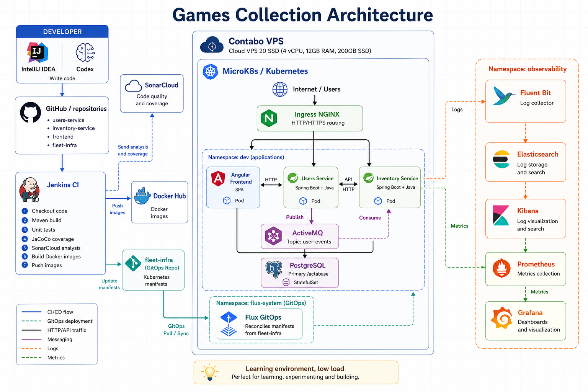

# Users Service

Spring Boot microservice responsible for authentication, user management, private user photos, and user lifecycle events in Games Collection.



## What It Does

- Registers and authenticates users with JWT.
- Manages users through CRUD endpoints.
- Stores private user photos in PostgreSQL.
- Exposes `whoami` endpoints for the authenticated user.
- Publishes user lifecycle events to ActiveMQ when users are created, updated, or deleted.
- Provides OpenAPI/Swagger documentation.
- Exposes Prometheus metrics through Spring Boot Actuator.

## Tech Stack

- Java 17
- Spring Boot 3.4
- Spring Security + JWT
- Spring Data JPA
- PostgreSQL
- Flyway
- ActiveMQ
- Springdoc OpenAPI
- Micrometer + Prometheus
- JUnit 5, Mockito, Testcontainers
- Maven
- Jib for Docker image publishing

## Requirements

- Java 17 or newer
- Maven 3.9 or the included Maven wrapper
- PostgreSQL 16, either local or through `kubectl port-forward`
- ActiveMQ, either local or through `kubectl port-forward`
- Docker, only for integration tests based on Testcontainers

## Clone

```bash
git clone <users-service-repository-url>
cd users
```

## Local Configuration

Default local configuration expects:

```properties
spring.datasource.url=jdbc:postgresql://localhost:5432/users
spring.activemq.broker-url=tcp://localhost:61616
spring.activemq.user=admin
spring.activemq.password=admin
```

Useful environment variables:

```bash
SPRING_DATASOURCE_URL=jdbc:postgresql://localhost:5432/users
SPRING_DATASOURCE_USERNAME=oscar
SPRING_DATASOURCE_PASSWORD=password
SPRING_ACTIVEMQ_BROKER_URL=tcp://localhost:61616
SPRING_ACTIVEMQ_USER=admin
SPRING_ACTIVEMQ_PASSWORD=admin
USER_EVENTS_TOPIC=games-collection.user-events
LOGGING_LEVEL_ROOT=INFO
LOGGING_LEVEL_APP=INFO
LOGGING_LEVEL_SECURITY=WARN
```

To use the Kubernetes services from your local machine:

```powershell
kubectl -n dev port-forward svc/postgres 5431:5432
kubectl -n dev port-forward svc/activemq 61616:61616
```

PowerShell example:

```powershell
$env:SPRING_DATASOURCE_URL="jdbc:postgresql://localhost:5431/users"
$env:SPRING_DATASOURCE_USERNAME="oscar"
$env:SPRING_DATASOURCE_PASSWORD="password"
$env:SPRING_ACTIVEMQ_BROKER_URL="tcp://localhost:61616"
.\mvnw.cmd spring-boot:run
```

## Run

```bash
./mvnw spring-boot:run
```

On Windows:

```powershell
.\mvnw.cmd spring-boot:run
```

## Tests

Unit tests:

```bash
./mvnw test
```

Full build without integration tests:

```bash
./mvnw clean verify
```

Integration tests with Testcontainers:

```bash
./mvnw verify -Pintegration-tests
```

Integration tests require Docker.

## Main Endpoints

Authentication:

```http
POST /api/v1/auth/signup
POST /api/v1/auth/signin
```

Authenticated user:

```http
GET /api/whoami
GET /api/whoami/photo
```

Users:

```http
GET    /api/users
GET    /api/users/all?page=0&size=10&sortField=email&sortDir=asc
POST   /api/users
PUT    /api/users?id={uuid}
DELETE /api/users?id={uuid}
GET    /api/users/photo?id={uuid}
```

User administration endpoints require the `ADMIN` role, except authentication and `whoami`.

## Observability

Actuator:

```http
GET /actuator/health
GET /actuator/prometheus
```

Swagger:

```http
GET /swagger-ui.html
GET /v3/api-docs
```

In the cluster, Swagger is available at:

```text
http://oscarfndez.eu/gamescollection/docs/users/swagger-ui.html
```

## Events

This service publishes JSON events to ActiveMQ:

```text
topic: games-collection.user-events
```

Supported event types:

```text
afterCreating
afterUpdating
afterDeleting
```

Inventory Service consumes these events to react to user changes.

## CI/CD

The `Jenkinsfile` runs:

- Checkout.
- `mvn clean verify`.
- SonarCloud analysis.
- Docker image publishing to Docker Hub with Jib.

Image:

```text
oscarfndez/users-service:build-<BUILD_NUMBER>
```

Kubernetes deployment is managed from the `fleet-infra` repository through Flux GitOps.
